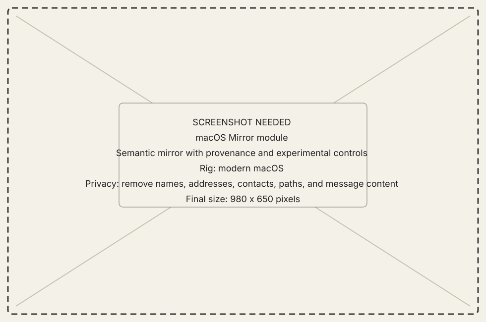
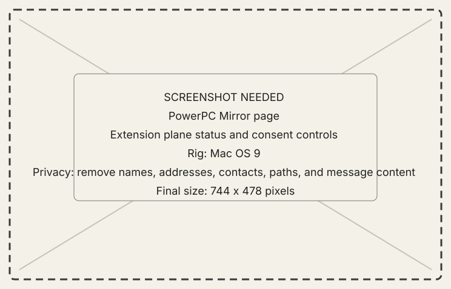
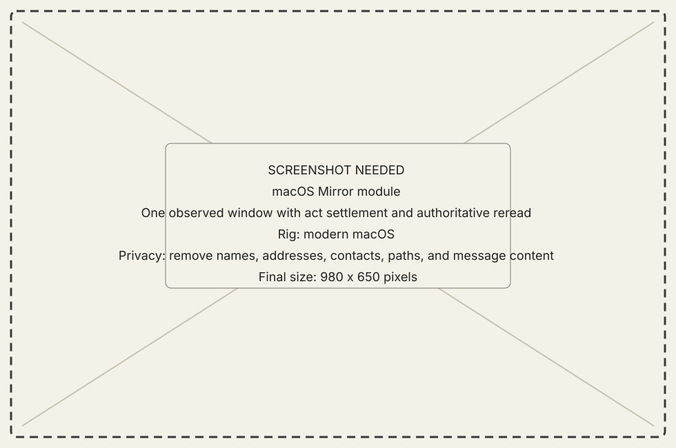

<!-- now-doc-provenance: generated reviewed=false -->

# Mirror module

## What it does

Mirror combines guest-observed window and interface information, optional
structured content, and host-native rendering. Actions drive the guest and
settle by rereading guest state.

{ .now-placeholder }

## Availability

Mirror is PowerPC-only and experimental. Its ordinary shell can work without
the optional Extension; live application structure, drawing activity, and
other deeper features may require it. The [feature coverage
matrix](../../explanation/core-features.md#feature-coverage) states which
user outcomes require the Extension. NOW-68K has no Mirror subsystem.

## On the modern Mac

The host joins scene identity, content, Finder semantics, references, and act
settlement. Human requests take priority over queued ambient reads at the next
safe boundary. Change notices combine redundant refreshes, and the host avoids
publishing a view that mixes older and newer state. A host-rendered interior
never becomes authority for guest state.

## On the classic Mac

The PowerPC page reports which Extension features are available and active.
The guest app remains the wire owner even when the Extension observes another
application.

{ .now-placeholder }

## Common tasks

- Observe before enabling act controls.
- Read provenance and Extension status before interpreting an empty interior.
- In Mirror mode, drag a host file onto the guest desktop, a Finder folder
  window or folder icon, or an application window or icon. The copy and any
  text/MacBinary conversion begin on release; the Mirror status strip reports
  transfer progress and final settlement.
- Drag a guest file out of the desktop or an observed Finder window. The host
  shows a native file-promise stub using the guest icon when available, and
  transfers only when the Finder or a host application accepts the drop.

{ .now-placeholder }

## Safety, consent, and privacy

Mirror can expose window titles, text, file rosters, and screen content. Agent
actions remain bounded by the machine's consent ceiling and visible host state.

Two permissions are required, and they answer different questions. The classic
Mac answers **whether** it may be mirrored at all: one switch, on the Mirror
page of its own Workshop, which refuses everything while it is off. This host
answers **which planes** are asked for, per machine, on the Planes card. A
plane runs only when both permit it; the Mirror page states the machine's
answer beside the resident's lifecycle rather than leaving it to be inferred
from planes that all read the same refusal.

## Failure states

Missing Extension feature, no writer, stale reference, not addressed,
timed-out settlement, invalidation gap, stale generation, and authoritative
refusal are not interchangeable. Gap or unknown hints trigger a repair read;
cadence polling remains available when no hint arrives.

## Current limitations

Finder and application interiors retain known incomplete behaviors. An
observation feature that was requested but produced no artifact cannot support
a rendering claim.

Queued human work does not preempt a guest traversal already running. The new
scheduler and coherent publication path are tested locally, but the PowerBook
1400c ambient-wait target is not metal-verified.

Cross-machine drag is PowerPC-only in this first version. The host-side routes
are tested locally but still await a PowerBook retest: a native host file is
intended to settle on the guest desktop, an exact Finder folder, or an
application, and a guest file is represented as an ordinary macOS file-promise
drag. It copies regular files one at a time; folders, move semantics, overwrite,
and NOW-68K are not included. A Finder target must carry an exact guest HFS
path, and an application target must still accept the delivered document;
either uncertainty is reported rather than replaced with a nearby guess.

The separately implemented Continuity display-edge route is currently broken
on physical hardware in both directions. Its host ownership tests pass, but no
host-to-guest or guest-to-host edge drag currently completes on the PowerBook;
do not treat that route as a working transfer workflow.

## For developers

See [Mirror architecture](../../../developer-guide/architecture/mirror.md) and
[the measured knowledge index](../../../mirror-knowledge.md).
