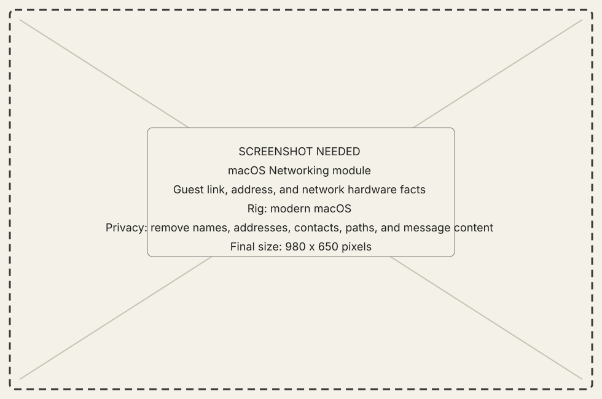
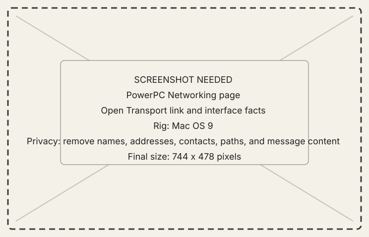

# Networking module

## What it does

Networking presents the guest's link state, address, network stack, and
available hardware facts separately from the host listener configuration.

{ .now-placeholder }

## Availability

PowerPC has a full Workshop page. NOW-68K shows a bounded MacTCP health and
address summary in its main window.

## On the modern Mac

The module shows facts reported by the selected guest. The host's own listener
address remains in Connections.

## On the classic Mac

PowerPC reports Open Transport and interface facts. NOW-68K reports MacTCP
health appropriate to System 7.1; Open Transport advice does not apply.

{ .now-placeholder }

## Common tasks

- Use [Configure a connection](../../how-to/configure-connection.md) to change
  endpoints.
- Use Networking to inspect the guest's reported link after connection.

## Safety, consent, and privacy

Addresses and adapter details can identify a private network. Scrub them from
public screenshots and support logs.

## Failure states

Stack unavailable, no address, link down, unsupported selector, stale session,
and disconnected are distinct states.

## Current limitations

This module does not encrypt or authenticate the wire. Use the trusted-network
boundary even when the link appears healthy.

## For developers

See [security reference](../../../developer-guide/reference/security.md) and
[wire architecture](../../../developer-guide/architecture/wire-contract.md).
