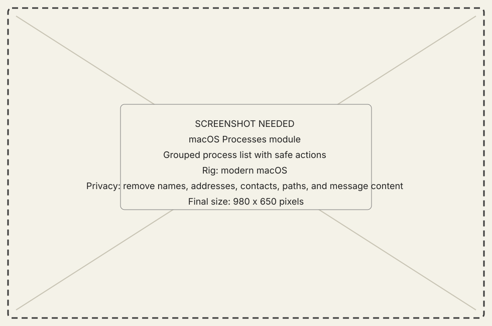
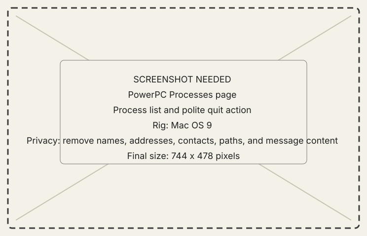

<!-- now-doc-provenance: generated reviewed=false -->

# Processes module

## What it does

Processes pages through what is running on the selected machine and exposes
actions the receiver can perform through its native Process Manager.

{ .now-placeholder }

## Availability

Host and PowerPC provide the paired module. NOW-68K supports process listing
and a smaller launch/front/quit command set.

## On the modern Mac

The host groups applications, keeps the selected machine explicit, and waits
for a typed result rather than claiming that a sent request changed state.

## On the classic Mac

The PowerPC page asks politely for quit and never force-kills an application.
NOW-68K exposes the same native-process seam through its console and wire.

{ .now-placeholder }

## Common tasks

- Refresh before acting on a process reference.
- Use front or quit from the selected row; verify the later listing.

## Safety, consent, and privacy

Quitting can discard unsaved work in the target application. NOW sends the
normal polite request and reports settlement separately from acknowledgement.

## Failure states

No process, stale reference, ambiguous name, request sent but outcome unknown,
not gone, and not front are different answers.

## Current limitations

Process identity and action depth differ by guest. A command acknowledgement
is not proof of exit.

## For developers

See [process and resident ladder](../../../processes-and-peek.md) and
[guest architecture](../../../developer-guide/architecture/ppc-guest.md).
