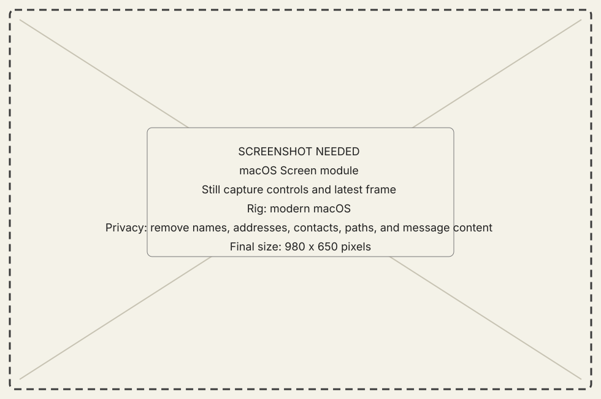
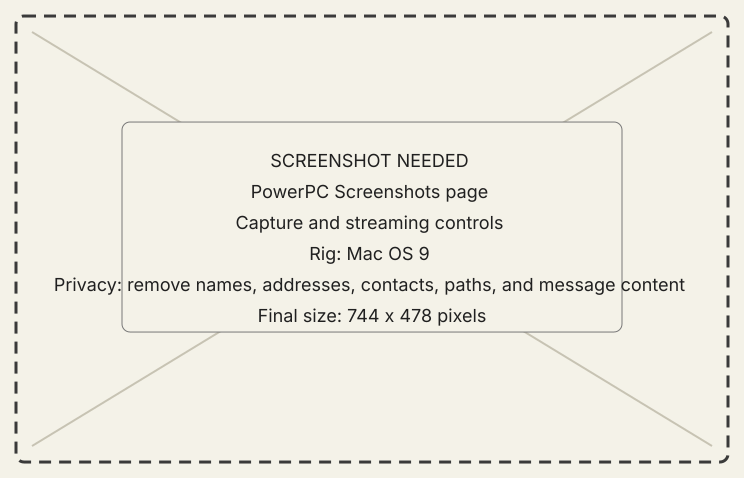
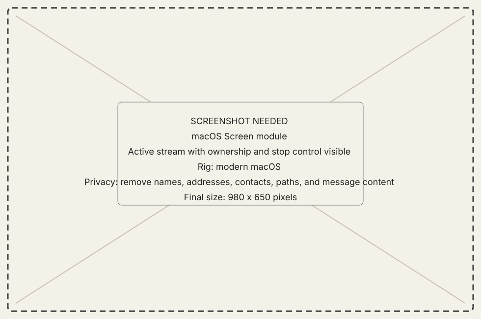

<!-- now-doc-provenance: generated reviewed=false -->

# Screen module

## What it does

Screen requests a still capture, receives a guest-initiated capture, or holds a
bounded stream from the selected classic Mac.

{ .now-placeholder }

## Availability

The macOS host and PowerPC Screenshots page provide the full surface. NOW-68K
supports a still-capture subset and local screenshot commands; treat streaming
and parity beyond that subset as unavailable unless the live capability says
otherwise.

## On the modern Mac

The host owns the displayed frame, transfer progress, stream bracket, and stop
control. The selected machine identity must remain visible when several guests
are connected.

## On the classic Mac

The PowerPC page can capture locally, offer a still, and participate in a
stream. NOW-68K can stage and send captures within its smaller memory budget.

{ .now-placeholder }

## Common tasks

- Start with [Configure a connection](../../how-to/configure-connection.md).
- Use the Screen page's capture control for a still; streaming remains a
  visibly owned bracket with a stop action.

{ .now-placeholder }

## Safety, consent, and privacy

A screen can contain private messages, names, file paths, and credentials.
Review captures before publishing them. An agent-opened stream remains visible
and stoppable by the person at the host.

## Failure states

Busy transfer, unsupported depth, capture refusal, digest mismatch, stale
session, and disconnect are distinct outcomes. A partial frame is not a still.

## Current limitations

Screen capture and Mirror's structured window rendering are different
features. A successful still does not prove Mirror content observation.

## For developers

See [wire contract](../../../developer-guide/architecture/wire-contract.md)
and [emulator and metal verification](../../../developer-guide/workflows/emulator-and-metal.md).
