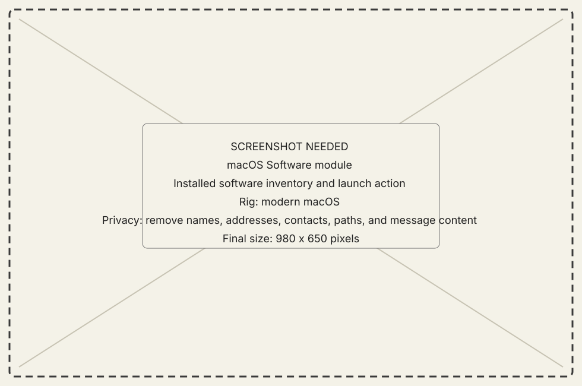
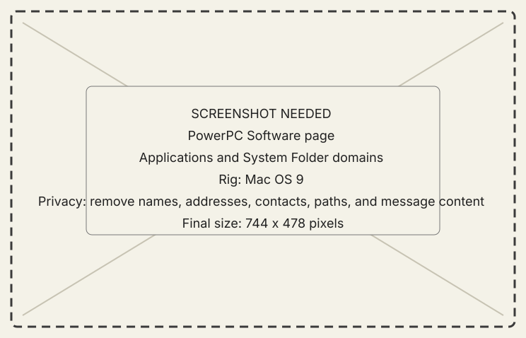

<!-- now-doc-provenance: generated reviewed=false -->

# Software module

## What it does

Software inventories applications, extensions, control panels, Startup Items,
and Apple Menu Items, including disabled System Folder siblings where served.

{ .now-placeholder }

## Availability

Both guests serve software listings. PowerPC exposes the complete Workshop
page; NOW-68K serves a bounded subset and its own launch command.

## On the modern Mac

The host pages and groups the selected guest's inventory and may join running
state from Processes. Launch remains a receiver-owned action.

## On the classic Mac

PowerPC separates application scans from System Folder domains. NOW-68K uses a
bounded catalog sweep appropriate to its memory and cooperative runtime.

{ .now-placeholder }

## Common tasks

- Refresh the desired domain instead of assuming one scan covers all software.
- Launch from a current application reference and verify the Processes list.

## Safety, consent, and privacy

Installed software reveals machine use. Launching may front an application and
change what a person at the classic Mac sees.

## Failure states

Domain unavailable, scan truncated, stale reference, ambiguous name,
non-application target, launch refused, and outcome unknown remain separate.

## Current limitations

Version reads may be lazy, and application inventory is intentionally bounded.
An incomplete scan reports itself rather than masquerading as the whole disk.

## For developers

See [software module design](../../../software-module.md) and
[guest architecture](../../../developer-guide/architecture/68k-guest.md).
