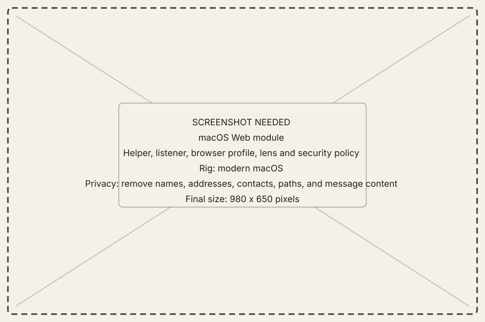
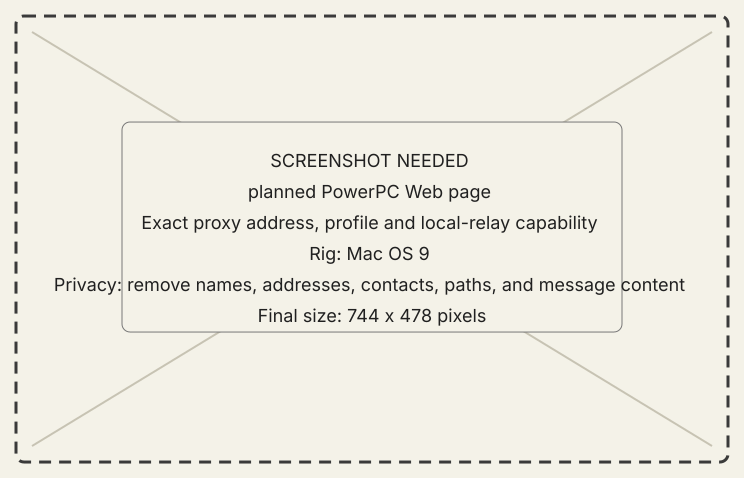

<!-- now-doc-provenance: generated reviewed=false -->

# Web Proxy module

## What it does

Web Proxy runs a guest-local HTTP proxy for a browser already installed on a
PowerPC Macintosh. Requests cross the existing NOW connection to the host,
which fetches HTTP and HTTPS pages, optionally runs
their contemporary JavaScript through Playwright, and returns bounded ASCII
HTML selected for Classilla, MacWeb, or a conservative 68K profile.

{ .now-placeholder }

## Availability

The PowerPC guest listens on its own loopback at `127.0.0.1:5180` by default.
The browser does not connect to the modern Mac's LAN address and no second
browser-facing port is opened there.

The PowerPC Workshop Web page saves only the guest-loopback port and reports
relay status. The host module owns the browser profile, rendering lens,
handlers, outbound policy, and internal renderer lifecycle.

NOW-68K does not yet ship a Web page or MacTCP relay.

## On the modern Mac

1. Choose a browser profile, rendering lens, and fetch engine.
2. Optionally choose an installed AI planner or model.
3. Start the renderer. Its private ephemeral loopback address is managed by
   New Old World and is not browser configuration.

Compatible Page is the deterministic default. Reader is a reduced view of the
same semantic block tree. AI Layout is optional and falls back to Compatible
Page when its planner is unavailable, invalid, slow, or over budget.

## On the classic Mac

Set Classilla's HTTP proxy to `127.0.0.1` and the port shown on the Workshop Web
page (`5180` by default). HTTPS destinations are fetched by the host and
rewritten through plain HTTP gateway links; NOW Web does not expose a general
CONNECT tunnel.

{ .now-placeholder }

## Common tasks

- Start the host renderer and leave the guest application running.
- Point Classilla at the guest's displayed loopback address and port.
- Choose MacWeb when the browser needs conservative HTML 2, flattened tables,
  ASCII entities, smaller pages, and 4 KB delivery chunks.
- Choose Reader for an article-oriented page without changing the browser
  profile.
- Return to Compatible Page whenever a handler, Reader, or AI Layout removes
  context needed to navigate the site.
- Stop the host renderer when the classic Mac is no longer browsing through it.

## Safety, consent, and privacy

The browser-facing listener accepts loopback peers only. The host renderer is
also loopback-only and ephemeral. The remaining network boundary is NOW's
existing plaintext guest-to-host connection, so use it only on a trusted
network.

Private, link-local, loopback, and special-use destinations are blocked by
default. The unsafe development switch broadens the host's outbound reach and
must not be enabled casually.

Ordinary helper logs omit request paths, URL queries, cookies, authorization,
and page bodies. The bridge does not import browser cookies or credentials.

## Failure states

Missing helper, stopped, starting, ready, incompatible helper protocol,
renderer failure, blocked destination, refused peer, unsupported browser
profile, expired page token, and unavailable AI planner remain distinct.

## Current limitations

- The static engine does not execute JavaScript. Playwright and Chromium are
  explicit optional dependencies and are never downloaded on a page request.
- Forms, logins, uploads, session replay, synthetic JavaScript event links,
  video, and a complete image-transcoding pipeline are not yet served.
- The PowerPC listener, wire relay, and host renderer build and have automated
  parser/codec tests, but have not yet been runtime-verified from Classilla.
- The optional local layout model is not distributed until its model card,
  base-model and training-data provenance, license, version, and checksum are
  settled. An already-installed local model folder can be selected in the host
  module; the first adapter cold-loads it per AI request.

## For developers

The source-tree implementation plan, operator note, and provenance inventory
are `docs/plans/2026-08-10-032-feat-web-bridge-plan.md`,
`web-bridge/README.md`, and `web-bridge/PROVENANCE.md`.
