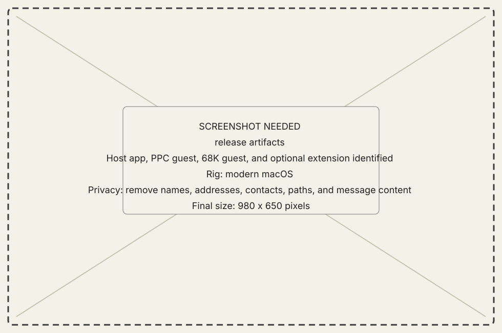

<!-- now-doc-provenance: generated reviewed=false -->

# Connect your first classic Mac

This tutorial gets one modern Mac and one classic Mac to the first named
session. The alpha bundle includes the NOW Extension, but this first connection
uses the normal applications and leaves the Extension uninstalled.

## What you need

- A Mac running macOS 13 or later.
- A PowerPC Mac running Mac OS 8.6–9.2.2 with CarbonLib 1.6.
- Both machines on a local network you control.
- The alpha bundle containing the host app, PowerPC guest, and optional NOW
  Extension.

{ .now-placeholder }

## 1. Put each application on its machine

Install **New Old World.app** on the modern Mac. The guided alpha path is
**Connections > Set Up a New Mac…**; follow [Set up a new PowerPC
Mac](../how-to/set-up-new-mac.md) to build and download a personalized setup
disk. That flow has host and emulator evidence but is not yet end-to-end
verified through a classic browser on hardware.

For the manual fallback, transfer **New Old World.bin** and let the transfer
tool restore its forks, then [configure the connection](../how-to/configure-connection.md).
In either path the bundled **NOW Extension** is an optional selection, not a
separate product or a requirement for the first connection.

## 2. Start the host listener

Launch New Old World on macOS. Open **Connections**, confirm the listener port,
and note an address the classic Mac can reach. Keep the window open for this
first connection.

{ .now-placeholder }

## 3. Point the classic guest at the host

Launch the guest on the classic Mac. On PowerPC, use the Workshop's
**Connection** page. Enter the host's reachable address and the same port,
then connect.

{ .now-placeholder }

## 4. Prove the session

The host should show the classic Mac by name, not merely say that a socket is
open. Open **Hardware** and request the overview, or open **Processes** and
refresh. A typed answer from the selected machine proves more than a green
connection light.

{ .now-placeholder }

## 5. Decide whether to install the bundled Extension

Open [Core features](../explanation/core-features.md). Ordinary modules do not
need the Extension. Install the bundled component only when you want to
evaluate the Extension-required Mirror features and can recover by booting
with Extensions disabled.

## Result

You now have a normal NOW session without the bundled Extension installed.
Continue with
[Transfer a file](../how-to/transfer-a-file.md), browse the
[module reference](../reference/modules/index.md), or compare
[core feature coverage](../explanation/core-features.md).

If the dial is refused or never settles, use
[Recover a connection](../how-to/recover-a-connection.md). Do not weaken the
network boundary to make a first run easier.
